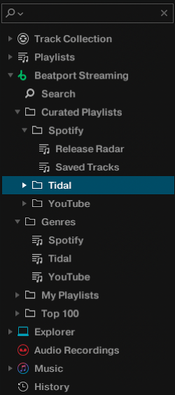

# traktor-streaming-proxy

Stream Spotify, YouTube and Tidal in Traktor DJ by serving a stand-in for Beatport's API.

</a>

Traktor supports streaming, but only from Beatport and Beatsource. This is an HTTPS server that
answers the parts of the Beatport API Traktor uses, backed by other sources. It ships a crafted
Beatport license, so no Beatport account or subscription is needed.

This branch runs natively on Windows: a JVM application with a tray icon and a control panel in the
browser. There is no Docker, no WSL and no Python.

As with real Beatport streaming, Traktor will not let you use its recorder.

## Requirements

- Windows
- A JDK, to build. [Temurin](https://adoptium.net/) or Oracle, 17 or newer.
- [ffmpeg](https://www.gyan.dev/ffmpeg/builds/) on `PATH`, used to convert what Spotify streams into
  the format Traktor accepts. `winget install Gyan.FFmpeg`
- Spotify Premium, for the Spotify source
- Traktor Pro 4

## Build

```
gradlew.bat installDist
```

Copy `build\install\traktor-streaming-proxy` anywhere you like, for example `C:\TraktorProxy`.
Keep it outside the repository: a rebuild replaces that directory and would take your settings and
downloaded tracks with it.

## Run

```
traktor-proxy.vbs
```

That starts it with no console window. Use `bin\traktor-streaming-proxy.bat` instead when you want
to watch the output. A tray icon appears; everything else is in the control panel at
**http://127.0.0.1:8088**, also reachable from the tray menu.

Tray menu: sign in or retry sources, open the control panel, open the log, open the app folder,
start with Windows, quit.

## Setup

The control panel does the setup itself. Open **Settings**; the installation section is green when
Traktor can reach the server, and tells you what is missing when it cannot.

- **Certificate.** Traktor talks to `api.beatport.com` over TLS and validates through Schannel,
  which builds its chain from the Windows certificate stores. A certificate for that name is
  generated, added to your trusted roots and checked at every start. Superseded ones are removed.
- **Hosts file.** `api.beatport.com` has to resolve to this machine. The entry is added if missing;
  because that file needs administrator rights, the panel offers a fix that asks for them.
- **Traktor patch.** Traktor checks the license with a platform specific key, and only the macOS one
  matches the license served here, so the embedded key is swapped. A `.backup` is kept beside the
  executable. Traktor must be closed, and it needs administrator rights.

Everything else is in the panel too, so `config.properties` never needs editing by hand.

## Spotify

Audio comes through librespot's own protocol. Metadata, playlists and search go to
`api.spotify.com`, and Spotify meters that quota per client id. librespot's built in id is shared by
every user of that library, so metadata calls made with it are rate limited no matter how little you
ask for: `429 API rate limit exceeded` on a single cold request, and *could not retrieve content* in
Traktor. Your own app id gives you a quota that is yours.

1. Create an app at [developer.spotify.com/dashboard](https://developer.spotify.com/dashboard). Free,
   no review. Tick **Web API**.
2. Add exactly this redirect URI: `http://127.0.0.1:5589/callback`
3. Put the client id into **Settings, Credentials**. There is no secret to store; the flow uses PKCE.

Enable Spotify under **Providers**. Two browser logins open on first start, one for librespot and one
for your app. Both are remembered, so it happens once.

A registered app in development mode cannot read Spotify's own editorial playlists, which is why
Release Radar and the Top 100 category are empty. Your playlists, saved tracks, followed artists and
search all work.

## Library

Tracks are converted once and kept, so loading the same track again costs a file read rather than a
download. They are named after the track, tagged with the metadata Spotify holds, and carry the
album art.

**Settings, Library** has the size limit, 10 GB by default and switchable off. When it is reached the
least recently played tracks are removed. The folder can be moved from there and the files follow.

## Library mapping

Beatport Streaming has fixed categories, which are matched to the sources as closely as they allow.
The genres are identical in each category, so they are used to tell the sources apart.

```
Curated Playlists
- <Genres>         --> source
 - <Playlists>     --> followed artists
  - <Tracks>       --> tracks from artist
Genres
- <Genres>         --> source
 - <Tracks>        --> saved/liked tracks in source
Playlists
- <Playlists>      --> playlists (all sources merged)
 - <Tracks>        --> tracks from playlist
Top 100
- <Genres>         --> source
 - <Tracks>        --> generated playlist of new released tracks
```

Enabling or disabling a source shifts these ids, so Traktor's Beatport cache is cleared when you do
and Traktor has to be restarted. The panel says so before it happens.

## Credits

[0xf4b1/traktor-streaming-proxy](https://github.com/0xf4b1/traktor-streaming-proxy) for the project,
and [@v1nc](https://github.com/v1nc) for the original Windows setup and the Traktor patcher this
build reimplements.
